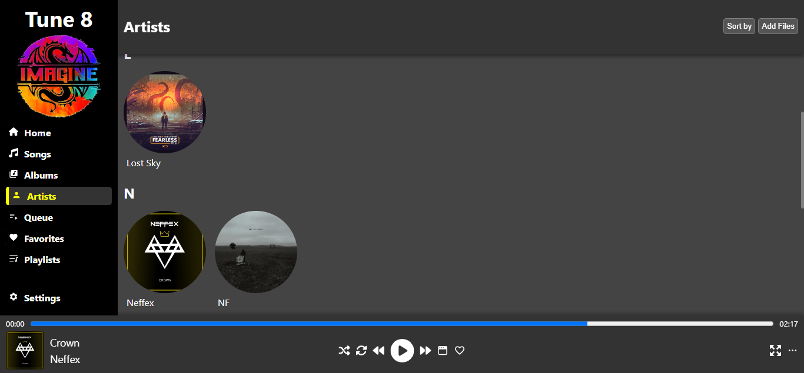
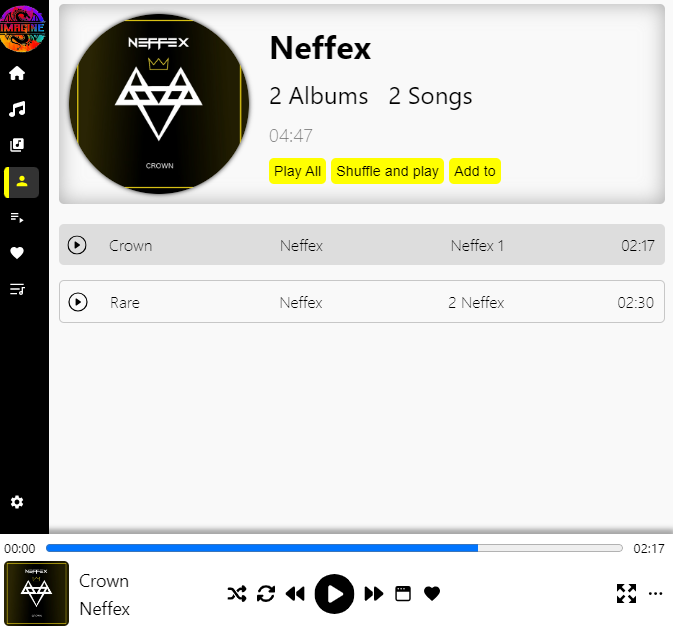

## Title
Electron Music App with Lyrics Integration

## Dark Mode - Full View

## Light Mode - Responsive View

## Description
Explore the world of music with Tune8, designed to deliver a seamless listening experience combined with the power of lyrics integration. Discover your favorite songs, access real-time lyrics, and save them for offline viewing.

## Features
Intuitive Interface: Enjoy a user-friendly interface that makes navigation effortless, allowing you to focus on what matters most - the music.
Lyrics Integration: Dive deeper into the meaning behind the songs with lyrics to your favorite songs. Get access to accurate and annotated lyrics in real-time.
Offline Lyrics: Lyrics automatically saved for offline viewing, ensuring you can enjoy them anytime, anywhere, without an internet connection.
Cross-Platform Compatibility: Tune8 seamlessly across multiple platforms, including Windows, macOS, and Linux.
Customizable Settings: Customize your music listening experience with adjustable settings for playback, display, and more.

# ***NB : Still in Development***
